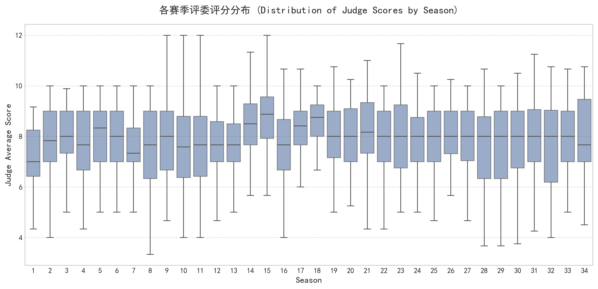
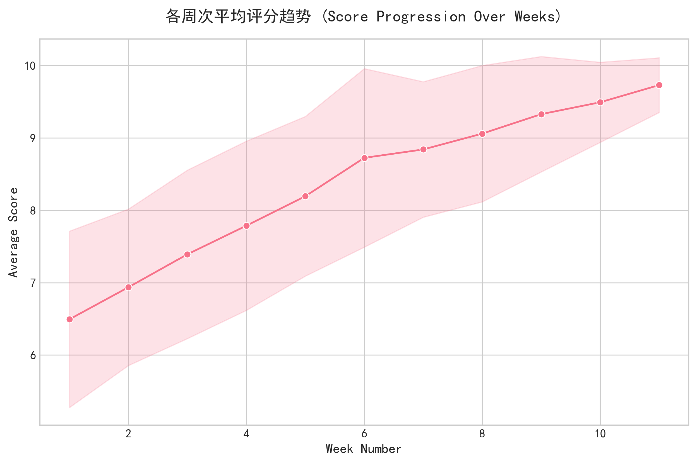
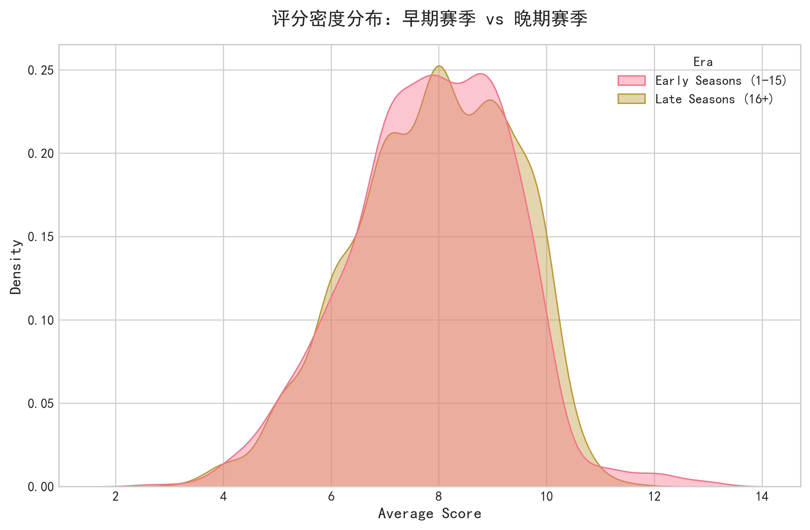
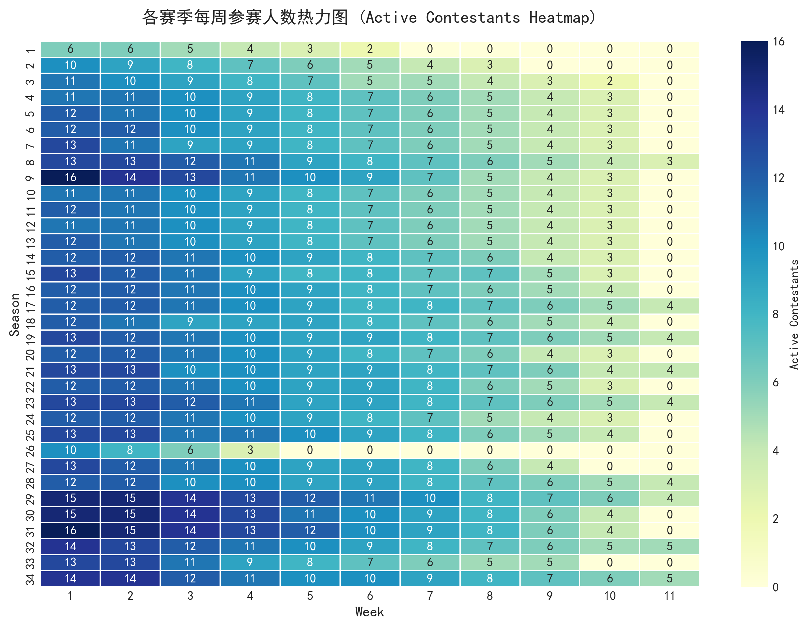
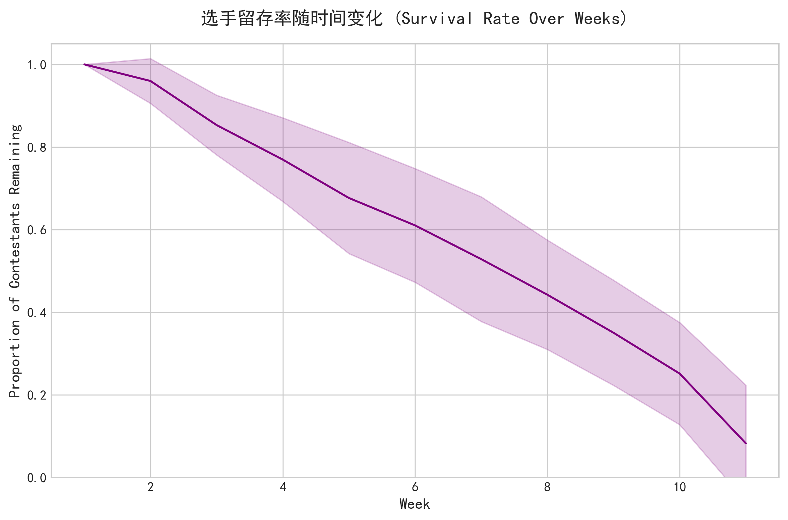
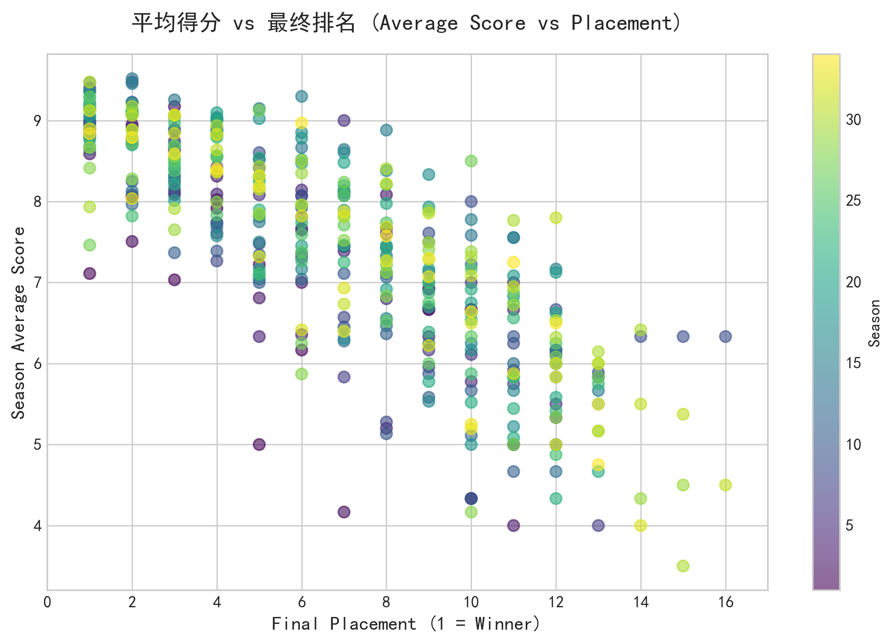
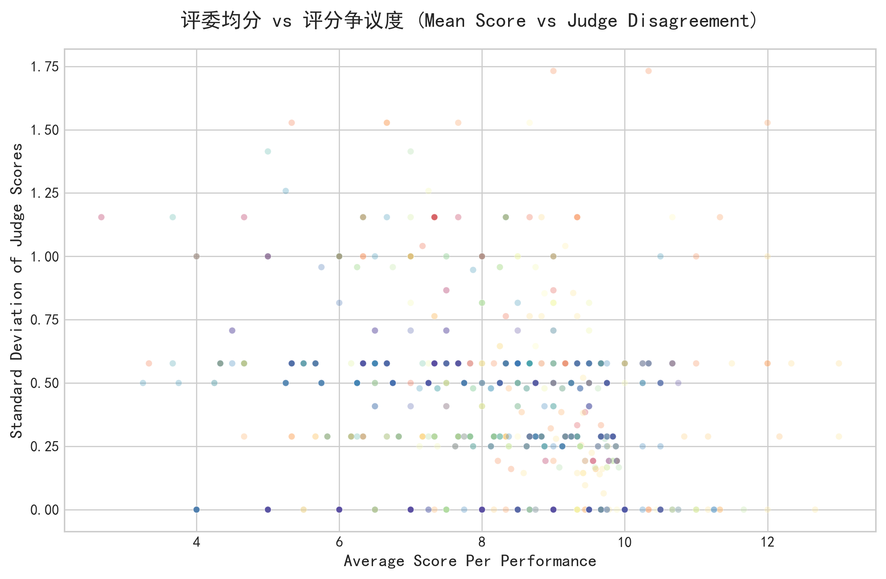
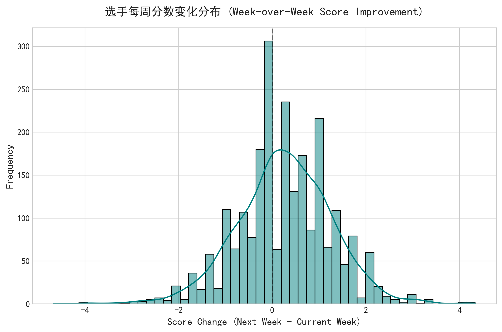

# 数据预处理说明 (Data Preprocessing)

## 1. 概述
本项目的数据预处理逻辑主要集中在脚本 `scripts/problem1a_fan_votes.py` 中。该阶段旨在将原始的比赛评分数据清洗为结构化的时序数据，以支持后续的观众投票反推及模型建立。

## 2. 数据来源
*   **输入文件**: `data/2026_MCM_Problem_C_Data.csv`
*   **数据内容**: 包含多季比赛的选手名单、合作伙伴、最终结果 (`results`) 以及每周的评委打分 (`weekX_judgeY_score`)。

## 3. 处理流程

### 3.1 数据加载与列识别
脚本首先读取 CSV 文件。由于每周的列名格式为 `week{W}_judge{J}_score`，使用了动态识别函数 `identify_week_columns` 来解析数据中存在的所有比赛周次。

### 3.2 评委分数计算 (`compute_week_scores`)
对于每一周 $t$：
*   识别当周所有评委的打分列。
*   将 "N/A" 替换为 `NaN`。
*   计算非空分数的数量 $m_{i,s,t}$ 和总和 $S_{i,s,t}$。
*   计算平均分 $J_{i,s,t} = S_{i,s,t} / m_{i,s,t}$。
*   若某选手当周无有效评分，标记为缺失。

### 3.3 淘汰周次提取与活跃状态判定
为了确定每位选手的参赛时间跨度（即 $T_{i,s}$），采取了双重验证策略：

1.  **正则提取 (`extract_elimination_week`)**:
    *   针对 `results` 列（例如 "Eliminated Week 4"），使用正则表达式 `(Eliminated|Withdrew).*Week\s+(\d+)` 提取明确的淘汰周次。
    
2.  **分数推断 (`last_active_week`)**:
    *   扫描所有周的评委均分，找到该选手拥有有效分数的最大周次。

3.  **最终判定 (`determine_final_last_active`)**:
    *   优先采用正则提取的周次（处理因退赛等特殊情况导致的记录）。
    *   若无明确文本说明（如冠军、亚军），则依据分数记录的最大周次作为其最后活跃周。

### 3.4 数据清洗与质量检查 (`validate_data_quality`)
执行了以下检查并将结果输出到 `outputs/fan_vote_data_quality_q1a.csv`：
*   **分数范围**: 检查是否存在小于 1 或大于 10 的异常分值。
*   **缺失率**: 统计每周的缺失数据比例。
*   **排名一致性**: 检查最终排名前 3 的选手（Winner/Runner-up）是否确实参加到了该季的最后一周。

## 4. 输出数据
预处理后的数据主要保留在内存中供 `problem1a` 的后续逻辑（观众投票估算）使用，生成的关键字段包括：
*   `week{t}_avg`: 每周评委均分。
*   `last_active_week`: 选手最后参赛周。
*   `season`: 赛季标识。

相关脚本可直接调用清洗逻辑，或读取 `problem1a` 生成的中间文件如 `outputs/fan_vote_estimates_q1a.csv` 进行后续分析。

## 5. 数据探索性可视化 (EDA)

为了直观展示预处理后的数据特征，我们编写了脚本 `scripts/data_preprocessing_visualization.py` 并生成了以下图表：

### 5.1 评分分布与趋势

**各赛季评委评分分布**
反映不同赛季评委打分的离散程度与中位数变化。

**各周次平均评分趋势**
随着赛程推进，选手表现和评委打分的整体上升趋势。

**评分密度分布 (早期 vs 晚期)**
对比早期与晚期赛季的评分分布，观察分数通胀现象。

### 5.2 参赛与淘汰模式

**各赛季每周活跃人数热力图**

**选手留存率曲线**
展示各赛季选手随时间被淘汰的速度。

### 5.3 进阶分析 (相关性与波动)

**平均得分 vs 最终排名**
验证高分与好名次之间的负相关关系。

**评委均分 vs 评分争议度**
分析高分/低分表现是否更容易达成共识。

**选手每周分数变化分布**
展示选手表现的波动性与进步幅度。

